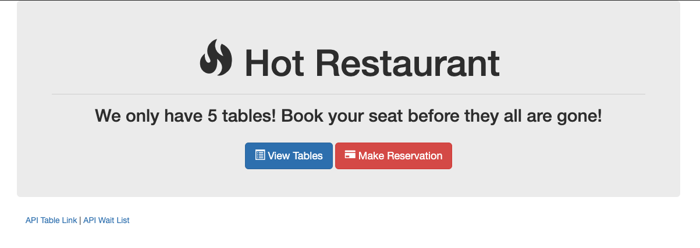

# HotRestaurant

- Description: Basic app demonstrating Node and Express with vanilla javascript. Overall purpose is to help schedule reservation requests. Restaurant has just 5 tables available. First five requests get a reservation, every request after that is sent to the waiting list.
- Live Demo at: https://young-forest-04638.herokuapp.com/
  

## Notes

- A MySQL database is not used. All data stored locally
- To run locally, use

      npm install

      node server.js

- Then use http://localhost:3000/
